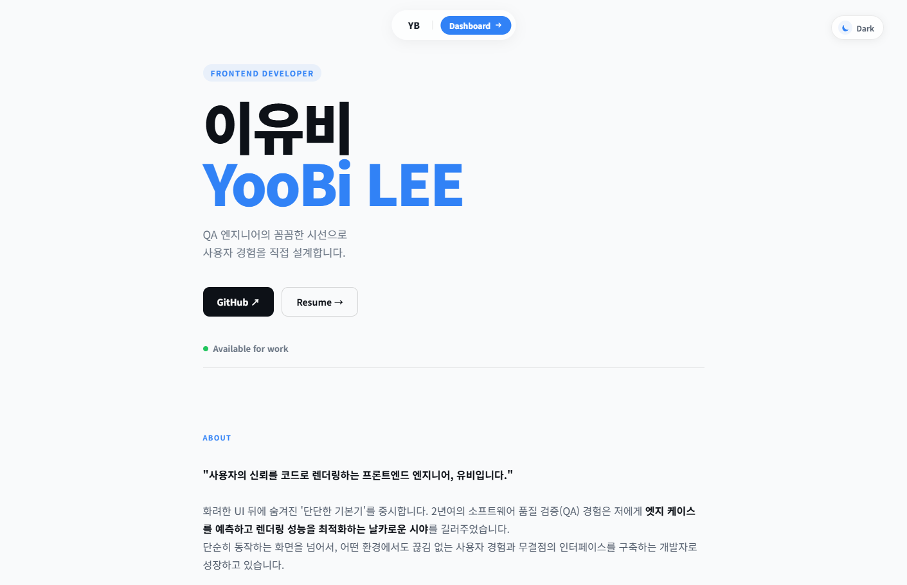
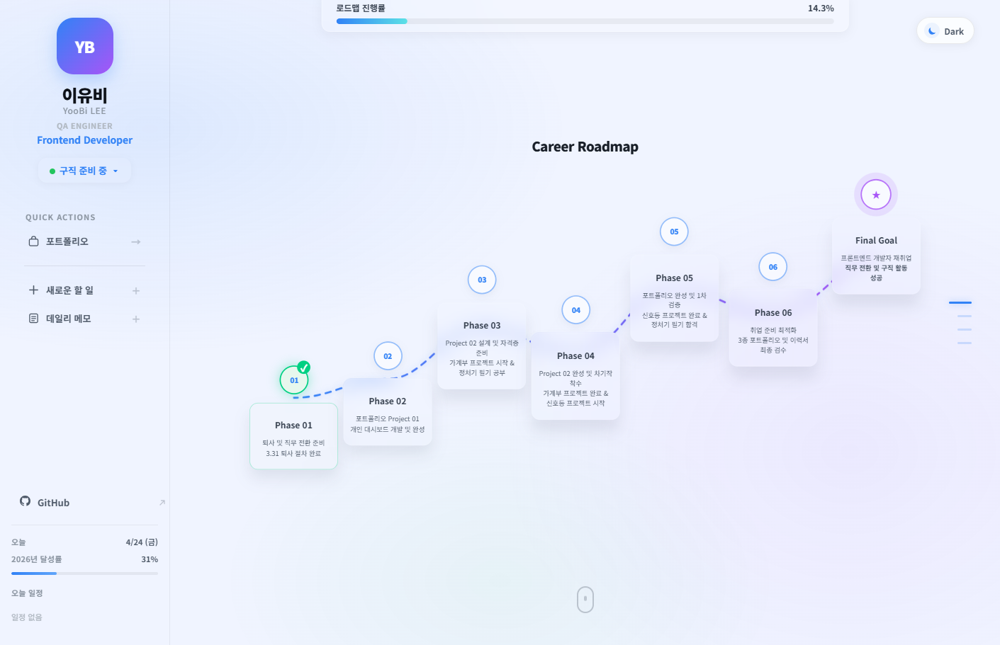

# YooBi's Personal Dashboard & Portfolio

> *QA 엔지니어의 꼼꼼한 시선으로, 버그가 없는 코드를 짜는 개발자를 목표로 합니다.*

**[🔗 Live Demo](https://yoobilee.github.io/personal-dashboard-ui/)**

 

외부 프레임워크 없이 Vanilla JS + Three.js로만 구현

 

## 소개

QA Engineer → Frontend Developer 전환 과정을 담은 개인 포트폴리오 겸 실사용 대시보드 SPA입니다.

단순한 이력서 페이지가 아니라, 실제로 매일 쓰는 칸반 보드 · 캘린더 · 지식 아카이브를 하나의 앱으로 통합했습니다. 토스 디자인 시스템에서 영향을 받은 글라스모피즘 UI를 기반으로 시각적 완성도와 실용성을 함께 추구했습니다.

 

## 스크린샷

| Portfolio | Dashboard |
|:---------:|:---------:|
|  |  |

 

## 주요 기능

| 페이지 | 기능 |
|--------|------|
| **Home** | Portfolio / Dashboard 탭 전환, 배경 Orb 그라데이션 페이드, 레이어드 글래스 카드 |
| **Portfolio** | Dynamic Island 네비, 스크롤 reveal 애니메이션, 프로젝트 카드 |
| **Career Roadmap** | SVG 곡선 로드맵, 단계별 완료 처리, 달성률 실시간 반영 |
| **Kanban Board** | 드래그 앤 드롭, 우선순위 설정, 카드 상세 모달 |
| **Calendar & Memo** | 월간 달력, 날짜별 메모 · 타임라인 탭 전환 |
| **Knowledge Archive** | 참고 링크 아카이브, 카테고리 필터 |

 

## 구현 포인트

**Hash 기반 SPA 라우팅**
`window.location.hash`로 페이지 전환을 처리하며 새로고침 시에도 마지막 위치를 복원합니다. 다크모드 상태는 `localStorage`를 통해 resume.html까지 모든 페이지에서 동기화됩니다.

**글라스모피즘 렌더링 최적화**
다중 글라스 요소 겹침 시 발생하는 크롬 컴포지터 레이어 충돌을 `transform: translateZ(0)` + `will-change`로 GPU 레이어를 분리해 해결했습니다.

**사이드바 토글**
`position: sticky` + `getBoundingClientRect()` 조합으로 사이드바 width transition과 완전히 동기화되는 슬라이드 토글을 구현했습니다.

**CTA 버튼 다크모드 버그**
`backdrop-filter`가 적용된 부모에서 `z-index` 스태킹 컨텍스트가 충돌해 호버 시 텍스트가 사라지는 버그를 `isolation: isolate`로 해결했습니다.

**GitHub 툴팁 overflow 탈출**
`overflow: hidden` 컨테이너 안에 갇힌 툴팁을 `getBoundingClientRect()`로 위치를 계산해 `position: fixed`로 렌더링해 해결했습니다.

 

---

Developed by **YooBi LEE** · QA Engineer → Frontend Developer

